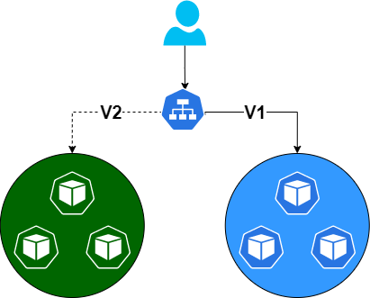
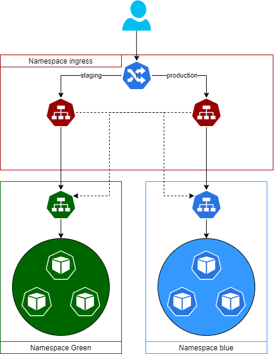

# Blue green with Kubernetes

Blue-Green is a well known deployment pattern which I will not cover here. The purpose of this course is to deploy a first blue green application.

## From Manifests files

The simplest way to perform a blue-green deployment is to implement it from manifests files.

### Service level



A blue green implementation at the Kubernetes service level will work, indeed a service has selectors used to identify the to route the traffic to. Although this solution is simple to implement, there are some drawbacks. Both pods versions must be deployed inside the same namespace which increase the risk of downtime in case of deployment troubles. In addition the newly created pods will not be exposed through a service as the only service is targeting the old version, thus it will be difficult to test the new version.

!!! warning
        Although this solution may work, it is not recommended to use it for production workload.

**Hands-on**

1. Copy the files below in a folder

=== "blue.yml"

    ``` yaml
    apiVersion: v1
    kind: Pod
    metadata:
    creationTimestamp: null
    labels:
        run: blue
        slot: blue
    name: blue
    spec:
    containers:
    - image: httpd:2.4.35
        name: blue
        lifecycle:
        postStart:
            exec:
            command: ["/bin/sh", "-c", "echo 'Hello blue' > /usr/local/apache2/htdocs/index.html"]
        resources: {}
    dnsPolicy: ClusterFirst
    restartPolicy: Always
    status: {}
    ``` 

=== "green.yaml"

    ``` yaml
    apiVersion: v1
    kind: Pod
    metadata:
    creationTimestamp: null
    labels:
        run: green
        slot: green
    name: green
    spec:
    containers:
    - image: httpd:2.4.46
        name: green
        lifecycle:
        postStart:
            exec:
            command: ["/bin/sh", "-c", "echo 'Hello green' > /usr/local/apache2/htdocs/index.html"]
        resources: {}    
    dnsPolicy: ClusterFirst
    restartPolicy: Always
    status: {}
    ```

=== "bluegreen-svc.yml"

    ``` yaml

    apiVersion: v1
    kind: Service
    metadata:
    creationTimestamp: null
    labels:
        app: bluegreen
    name: bluegreen
    spec:
    ports:
    - name: 80-80
        port: 80
        protocol: TCP
        targetPort: 80
    selector:
        slot: blue
    type: ClusterIP
    status:
    loadBalancer: {}
    
    ```

2. From the folder, execute the commands

  ```shell
  kubectl apply -f ./
  ```
3. Open a proxy to the website

```shell
  kubectl  port-forward svc/bluegreen 8080:80
```

4. Navigate to `http://localhost:8080`
5. Update the service selector section to use green instead of blue
6. Execute

```shell
  kubectl apply -f ./
```
1. Navigate to `http://localhost:8080`

Now the service is redirecting the traffic to the green website

!!! info "Conclusion"
    A simple service selector switch allows to perform a blue green deployment
    The code used to perform the hands-on is available [here](https://github.com/angegar/k8s-nginx-bluegreen)

### Ingress level


In this schema, we see the current stable application inside the blue circle, those pods are exposed through a Kubernetes service with the label selector V1. The green pods are the new ones exposed with label selector V2, to perform a blue green deployment the ingress controller will be updated to direct the traffic to the V2 service.

**Hands-on**

1. Copy the files below in folder
2. From the folder, execute the commands

        kubectl apply -f ./

3. Navigate to `http://website.<your ingress wildcard>` (ex: `website.1ffa2ce62a1a4c608aea.francecentral.aksapp.io`)
4. Update the ingress controller backend service to blue-svc
5. Navigate to `http://website.<your ingress wildcard>` (ex: `website.1ffa2ce62a1a4c608aea.francecentral.aksapp.io`)

=== "blue.yml"

    ``` yaml
    apiVersion: v1
    kind: Pod
    metadata:
      labels:
        slot: blue
      name: blue
    spec:
      containers:
      - image: httpd:2.4.35
        name: blue
        lifecycle:
          postStart:
            exec:
              command: ["/bin/sh", "-c", "echo 'Hello blue' > /usr/local/apache2/htdocs/index.html"]
        resources: {}
      dnsPolicy: ClusterFirst
      restartPolicy: Always
    ``` 

=== "green.yaml"

    ``` yaml
    apiVersion: v1
    kind: Pod
    metadata:
      labels: 
        slot: green
      name: green
    spec:
      containers:
      - image: httpd:2.4.46
        name: green
        lifecycle:
          postStart:
            exec:
              command: ["/bin/sh", "-c", "echo 'Hello green' > /usr/local/apache2/htdocs/index.html"]
        resources: {}    
      dnsPolicy: ClusterFirst
      restartPolicy: Always
    ```

=== "blue-svc.yml"

    ``` yaml

    apiVersion: v1
    kind: Service
    metadata:
      labels: {}
      name: blue-svc
    spec:
      ports:
      - name: 80-80
        port: 80
        protocol: TCP
        targetPort: 80
      selector:
        slot: blue
    type: ClusterIP
    
    ```

=== "green-svc.yml"

    ``` yaml

    apiVersion: v1
    kind: Service
    metadata:
      labels: {}
      name: green-svc
    spec:
      ports:
      - name: 80-80
        port: 80
        protocol: TCP
        targetPort: 80
      selector:
        slot: green
      type: ClusterIP
    
    ```

=== "ingress.yaml"

    ```yaml

    apiVersion: networking.k8s.io/v1
    kind: Ingress
    metadata:
      name: bluegreen-ing
      labels: {}
      annotations: 
        kubernetes.io/ingress.class: addon-http-application-routing #deprecated annotation
    spec:
      ingressClassName: addon-http-application-routing
      rules:
        - host: website.1ffa2ce62a1a4c608aea.francecentral.aksapp.io
          http:
            paths:
            - path: /
              pathType: Exact
              backend:
                service:
                    name: green-svc
                    port: 
                        number: 80
        - host: blue.1ffa2ce62a1a4c608aea.francecentral.aksapp.io
          http:
            paths:
            - path: /
              pathType: Exact
              backend:
                service:
                    name: blue-svc
                    port: 
                        number: 80
        - host: green.1ffa2ce62a1a4c608aea.francecentral.aksapp.io
          http:
            paths:
            - path: /
              pathType: Exact
              backend:
                service:
                    name: green-svc
                    port: 
                        number: 80

    ```

!!! info
    To use the code above you will have to update FQDN to match your DNS zone.
    The code used to perform the hands-on is available [here](https://github.com/angegar/k8s-nginx-bluegreen){target=_blank}

!!! info "Conclusion"
    In switching the backend service of an ingress, a blue green deployment can be done.

## Blue green deployment with Helm

### Single namespace

Helm is a Kubernetes package manager allowing to package deployment playbooks and apply configuration on it to obtain the final infrastructure. Each time a deployment related resource is modified, Helm will create a new version of the Helm release and update the resources. In this condition it is hard to perform a blue-green deployment with a single chart as each time a container version will be upgraded, all the deployment related resources will be refreshed, removing the current production version which is replaced by a new one in a rolling update way. I read there are solution which I did not manage to fully implement, however I think there is huge risk to have one namespace containing multiple version of the same application. In case of trouble we can easily break the production.

### Multiple namespaces

The propose solution will use multiple namespaces, one for each version of the application using the same Helm chart, and another to host the ingress which will do the switch been blue and green.



**Hands-on**

1. Get the code from [here](https://github.com/angegar/k8s-nginx-bluegreen)
2. The file scripts/deploy.sh contains the different steps to perform a bluegreen deployment

```shell
# filename: deploy.sh
#!/bin/bash -e

# Get current namespace
if [ $(kubectl get pods -n blue --no-headers=true | wc -l) -eq 1 ]; then
    newNamespace=green
    oldNamespace=blue
else
    newNamespace=blue
    oldNamespace=green
fi

echo "Deploy new version into the namespace $newNamespace"

helm upgrade \
   -f ./bluegreen/values.yaml \
    --install \
    --atomic \
    --create-namespace \
    --namespace $newNamespace \
    bluegreen ./bluegreen/

echo "Update ingresses to get a link to the new version $newNamespace"

helm upgrade \
   -f ./bluegreen-ing/values.yaml \
    --install \
    --atomic \
    --create-namespace \
    --namespace bluegreen-ing \
    --set productionBackend="bluegreen.$oldNamespace.svc.cluster.local" \
    --set stagingBackend="bluegreen.$newNamespace.svc.cluster.local" \
    bluegreen-ing ./bluegreen-ing/

read -rs -p 'Switch production ?'
echo "Switch the production to the new version in the namespace $newNamespace"

helm upgrade \
   -f ./bluegreen-ing/values.yaml \
    --install \
    --atomic \
    --create-namespace \
    --namespace bluegreen-ing \
    --set productionBackend="bluegreen.$newNamespace.svc.cluster.local" \
    --set stagingBackend="bluegreen.$oldNamespace.svc.cluster.local" \
    bluegreen-ing ./bluegreen-ing/

echo "Delete the old version from the namespace $oldNamespace"
helm delete -n $oldNamespace bluegreen
```

The code deploys a new version of the App Helm chart in a deployment slot (blue or green), then it deploys an ingress controller. Once the tests have been performed on the new version the ingress is updated in switching the deployment slot to target the new production.

!!! info
    The command below can be used to spin up a pod containing network troubleshooting tools.

        kubectl run -n bluegreen-ing tmp-shell --rm -i --tty --image nicolaka/netshoot -- /bin/bash

    The code used to perform the hands-on is available [here](https://github.com/angegar/k8s-nginx-bluegreen)

## Advanced with Istio

TBD
