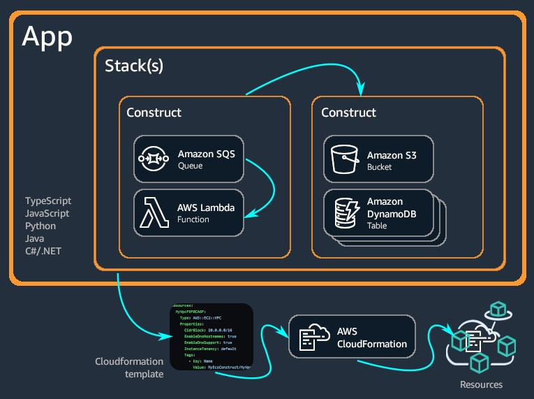
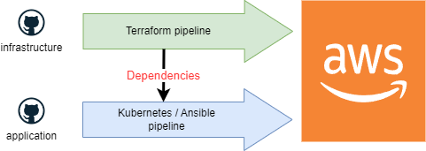
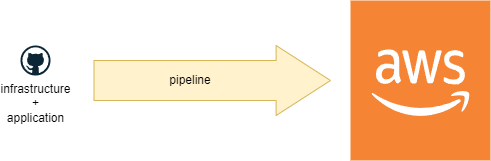
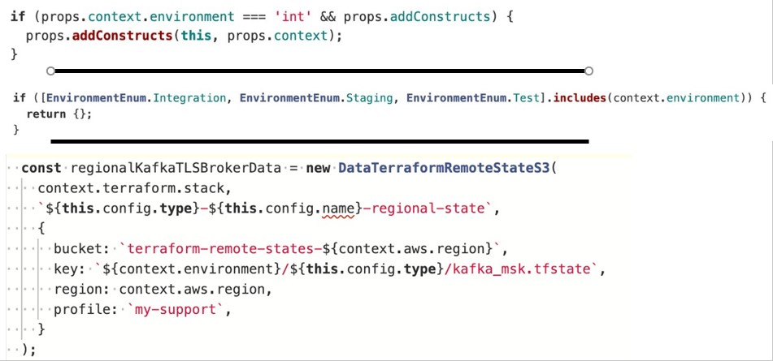
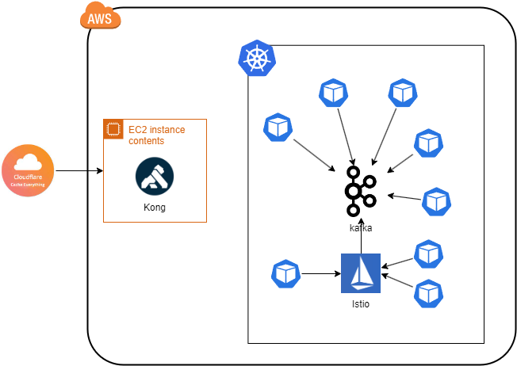

# CDK - The GOOD The BAD and The Ugly

---

# About me

❤ Cloud

❤ Kubernetes

❤ DevOps

❤ Coaching

---

# Problem Statement

<!--
Platform engineers:

- concevoir et construire des chaines d'outils et des processus permettant l'autonomie des développeurs sur les sujets du cloud

- fournir des librairies / interface aux utilisateurs
-->
Platform engineers need to :

- Manage infrastructures at scale (CDK)
- Manage applications configuration at scale ([CDKTF](https://www.terraform.io/cdktf) | [CDK8S](https://cdk8s.io/))
- Provide clients with services to deploy and maintain applications into the cloud

MUTUALIZE THOSE EFFORTS => LIBRARY CREATION

---

# The GOOD

---

<!--
Construct:

- pb est de définir le niveau d'abstraction du construct
- ensemble logic de composants contenant la valeur ajoutée de l'entreprise
- 1 stack par environnement

-->

# Features

- Programmatically manage AWS Cloud
- Use usual programming languages
- Polyglot libraries thanks to [JSSI](https://github.com/aws/jsii)
- Use standard language libraries as part of CDK projects

---

# Easyly create infrastructure

- CDK construct contains shortcup which speed up the development
- IAM permissions are implicitly managed

	`lambdaFunction.addEventSource(s3PutEventSource);`
<!--
The code above is used to trigger a lambda function when a file is added to a S3 bucket. The IAM permission are automatically manage so that there is not need to code the permisions.
-->

---

# Software Delivery Life Cycle

- Enable developers to manage their infrastructure with their preferred language
- Organize code with software architecture patterns
- Test code as any other code
- Review code as any other code
- Package code with application one

---

# One language to rule them all 1/2

---

# One language to rule them all 2/2

---

# The BAD

---

# An imperative vs declarative approach

- A **declarative approaches focus on the final state (what)** such as "I want a red car". It does not matter how this red car will be created.
- A **imperative approaches focus on the steps to reach a state (how)** such as "to create a red car you will have to perform those thousands steps to finally paint the car in red.

---

# Development best practices

| [Twelve factors app](https://12factor.net/config) | [AWS CDK Best Practices](https://docs.aws.amazon.com/cdk/v2/guide/best-practices.html) |
|--------------------|------------------------|
|Apps sometimes store config as constants in the code. This is a violation of twelve-factor, which requires strict separation of config from code. Config varies substantially across deploys, code does not.|In traditional AWS CloudFormation scenarios, your goal is to produce a single artifact that is parameterized so that it can be deployed to various target environments after applying configuration values specific to those environments. In the CDK, you can, and should, build that configuration right into your source code|

---

# Immutability, Idempotency, Predictability

- **Immutability**: recreate resources following specifications rather than modify resources in place.
- **Idempotency**: get the same result independently on how many time a code run
- **Predictability**: ensure the test results in an environment n is equal to the ones in an environment n-1

By the default those properties are guaranty by the underlying layers in a declarative approach, whereas its is up to the developer to ensure it in an imperative one.

---

# The UGLY

---

# Environment agnostic

- Such code is not environment agnostic
- Such code is not predictable through the CD pipeline
- Such code can't be correctly tested

---

# Single pane of glass

<!--
Sur ce diagramme:
- tout peut être géré avec du CDK
- AWS CDK pour la partie cloud
- CDKTF pour la partie kong / clouflare
- CDK8s pour la partie kubernetes
-->
POOR:
- CDKTF allows to configure a lot of architectural components
- Useful to get information from one component and inject it in another one

BUT :
- Do not manage everything from one deeply coupled library

---

# TFSATE spaghetti

<!--
il y a bcp de providers.

Soit on regroupe les providers dans un backend => problème de découplage des cycles de vie

Soit on multiplie les backend => problème de gestion des backends
-->
- 2537 [providers](https://registry.terraform.io/browse/providers)
- 264 official + community providers

- To decouple component lifecycle, multiple tfstate must be created
- Tfstate contains the infrastructure memory
- Tfstate can contain sensitive data

---

# Conclusion

## Pros

- CDK solved a huge variety of problems
- The imperative approach allows a huge flexibility in interconnecting systems.

## Cons

- Good software architecture skills are required to keep the code maintainable.
- Code is not fully mutualised across environments
- Easy to fall in a monolith approach
- Do not enforce the separation of concerns

---

# Opiniated solution

- Try to move to IaaC based on [Kubernetes controllers](https://aws.amazon.com/blogs/containers/aws-controllers-for-kubernetes-ack/) (*work very well when customer wish to move to kubernetes*)
- Keep CDK to create kubernetes controllers
- Avoid to use CDKTF because of the constraints bring by TFSTATE files.

---

# Links

- <https://github.com/aws-samples/aws-cdk-examples>
